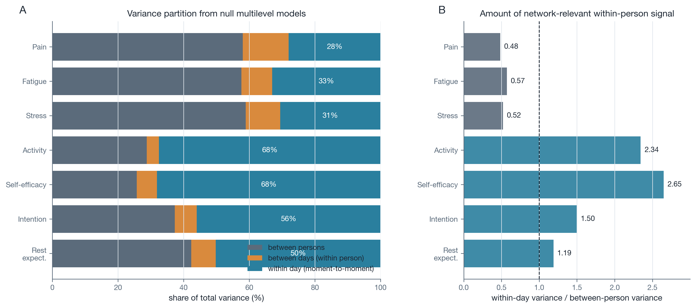
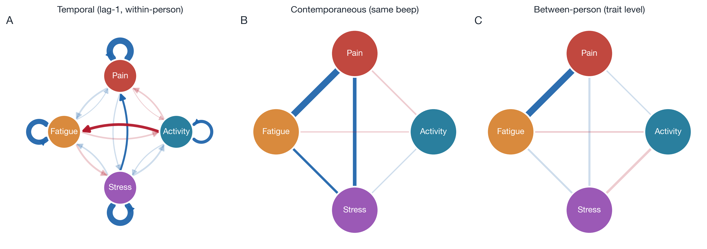
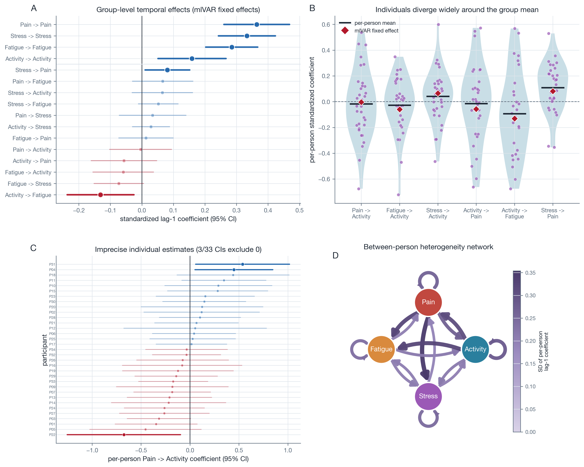
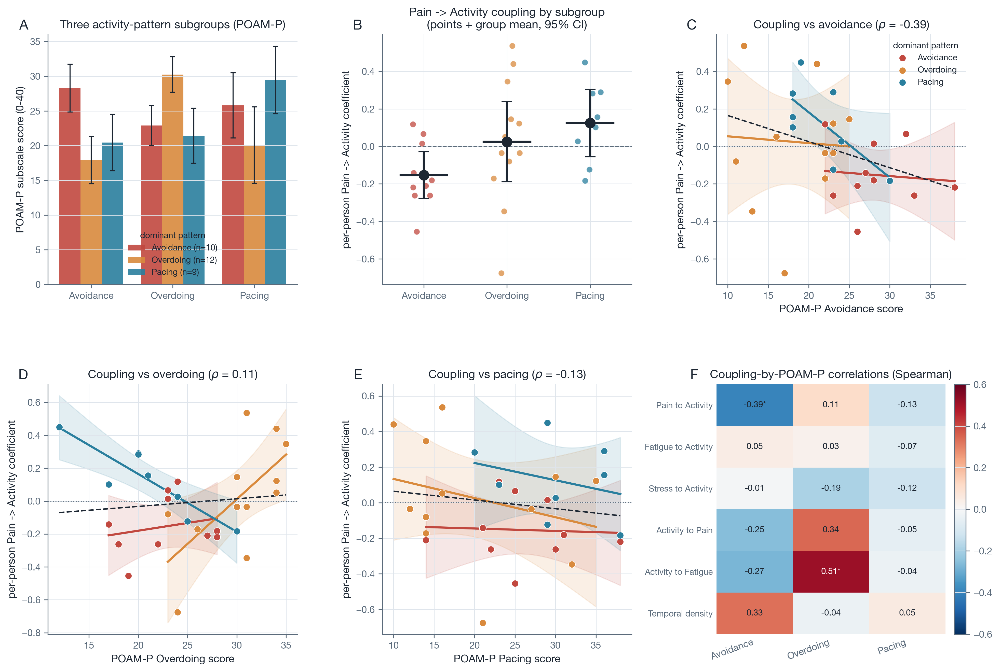

<div align="center">

# "Walk on": A Health Psychology Perspective on Physical Activity in Fibromyalgia

### Determinants of physical activity in fibromyalgia: an EMA network analysis

Annick De Paepe &middot; Stijn Van Severen &middot; Delfien Van Dyck &middot; Geert Crombez

**Ghent Health Psychology Lab, Ghent University**

[](src/utils/pipeline/separate/05_mlvar)
[](src/utils/pipeline/full/run_all.py)
[](src/utils/pipeline/full/run_all.py)
[-B7410E)](paper/report/main.tex)

</div>

---

## Table of Contents

- [[O] Overview](#o-overview)
- [[RQ] Research Questions](#rq-research-questions)
- [[R] Key Results](#r-key-results)
- [[M] Method Decision](#m-method-decision)
- [[F] Most Relevant Figures](#f-most-relevant-figures)
- [[D] Repository Structure](#d-repository-structure)
- [[Run] How To Reproduce](#run-how-to-reproduce)
- [[Review] Review Notes](#review-review-notes)

---

## [O] Overview

This repository contains a reproducible analysis pipeline and manuscript for the Walk On EMA
study in fibromyalgia. The analytic sample contains 34 women with fibromyalgia, 1,894
scheduled EMA prompts, and 1,474 completed assessments across 14 days. Momentary pain,
fatigue, stress, motivational states, and objective physical activity were modelled together
with wrist-accelerometer ENMO.

The analysis is organized around partial-pooling network models. Statistical models are
written in R, run from a Python orchestrator, and exported to manuscript-ready figures and
tables.

---

## [RQ] Research Questions

1. How do pain, fatigue, and stress relate to objective physical activity within individual
   patients with fibromyalgia?
2. Are baseline activity-pattern subgroups, measured with the POAM-P, reflected in the
   momentary pain-activity dynamics?

---

## [R] Key Results

- Objective activity was primarily momentary within-person variation: 67.5 percent of
  activity variance was within-day.
- The primary mlVAR showed positive autoregression for pain, fatigue, stress, and activity.
- Higher activity predicted lower subsequent fatigue (b = -0.131, SE = 0.054, p = .015,
  bootstrap 95 percent CI [-0.247, -0.038]).
- Higher stress predicted higher subsequent pain (b = 0.081, SE = 0.036, p = .027,
  bootstrap 95 percent CI [0.017, 0.150]).
- The average pain -> activity path was near zero (b = -0.004, SE = 0.050, p = .936), but
  per-person pain -> activity coefficients ranged from -0.68 to 0.54.
- POAM-P dominant pattern was associated with pain -> activity coupling (Kruskal-Wallis
  H = 6.46, p = .040; permutation p = .037): avoiders showed negative mean coupling,
  overdoers were near zero, and pacers showed positive mean coupling.
- The temporal network was stable across detrending, activity transformations, stricter
  compliance criteria, movement-possible prompts only, leave-one-participant-out refits, and
  person-level bootstrap resampling.

---

## [M] Method Decision

The central methodological issue is whether fully individual networks are defensible with a
median of 44 completed prompts per participant. The evidence points to a clear answer:

- graphicalVAR selected a median of 0 temporal edges per person.
- S-GIMME recovered the autoregressive paths but no group-level cross-variable path.
- Data-driven S-GIMME subgrouping was weak, with two small groups and many singletons.
- mlVAR is therefore the primary model because it pools information across participants
  while still estimating heterogeneity.

Fully individual models are retained as feasibility and sensitivity analyses, not as the
primary inferential model.

---

## [F] Most Relevant Figures

The main figures that carry the empirical argument are shown here. All main and
supplementary figures are stored under [`paper/assets/figures`](paper/assets/figures).

**MAIN_01: Multilevel variance decomposition**



Objective activity contains enough within-day variation to justify temporal within-person
modelling, whereas symptoms are more dominated by between-person differences. This figure
motivates why the paper treats momentary dynamics as the primary analytic level.

**MAIN_02: Group-level momentary networks**



The temporal network shows persistence in all four nodes, plus the two clearest
cross-lagged signals: activity to lower subsequent fatigue and stress to higher subsequent
pain. The contemporaneous and between-person panels show that symptom clustering is much
stronger at the same prompt and trait level than as cross-lagged prediction.

**MAIN_03: Group temporal effects and individual heterogeneity**



The average symptom-to-activity effects are close to zero, but the per-person distributions
are wide and include opposite directions. This is the key evidence that group averages alone
hide clinically relevant heterogeneity, while fully separate individual estimates remain too
imprecise at this series length.

**MAIN_04: POAM-P subgroups and pain-to-activity coupling**



The pain-to-activity coupling aligns with baseline activity pattern: avoidance is
associated with more negative coupling, overdoing is near zero, and pacing is positive on
average. This supports the RQ2 claim that activity-pattern information helps interpret
heterogeneous momentary dynamics.

---

## [D] Repository Structure

```text
.
├── paper/
│   ├── assets/
│   │   ├── figures/main/
│   │   ├── figures/supplementary/
│   │   └── tables/
│   └── report/
│       ├── main.tex
│       ├── main.pdf
│       └── references.bib
└── src/
    ├── data/
    │   ├── raw/
    │   └── processed/
    ├── results/
    │   ├── models/
    │   ├── networks/
    │   ├── tables/
    │   └── REVIEW.md
    └── utils/
        ├── lib/
        ├── study_materials/
        └── pipeline/
            ├── full/run_all.py
            └── separate/01..12
```

---

## [Run] How To Reproduce

### Local Pipeline

```bash
make setup
make run-all
```

Resume from a stage, or run one stage:

```bash
make run-from STAGE=05
make run-stage STAGE=12
```

### Manuscript

```bash
cd paper/report
tectonic main.tex
```

References use natbib plus the bundled `apalike` BibTeX style, so biber is not required.

### Docker

Docker support is in [`docker/`](docker). The image builds from the `docker/` directory
only, so private raw data are not part of the Docker build context. At runtime, Compose
mounts the repository into `/workspace` and runs the same Makefile checks as the local
workflow.

```bash
docker compose -f docker/docker-compose.yml build
docker compose -f docker/docker-compose.yml run --rm paper-analysis
```

Raw and processed participant-level data are intentionally excluded from Git. Keep the
private data on the local machine under `src/data/raw/`. The full statistical pipeline also
requires the R modelling packages used by the local workflow (`mlVAR`, `gimme`,
`graphicalVAR`, `lme4`, `lmerTest`, `tseries`).

---

## [Review] Review Notes

The consolidated review guide is in [`src/results/REVIEW.md`](src/results/REVIEW.md). The
paper draft is in [`paper/report/main.tex`](paper/report/main.tex) and compiles to
[`paper/report/main.pdf`](paper/report/main.pdf).

The manuscript now uses Annick De Paepe's ORCID (`0000-0002-9366-3692`) and Stijn Van
Severen's ORCID (`0009-0003-9181-966X`) on the title page.
